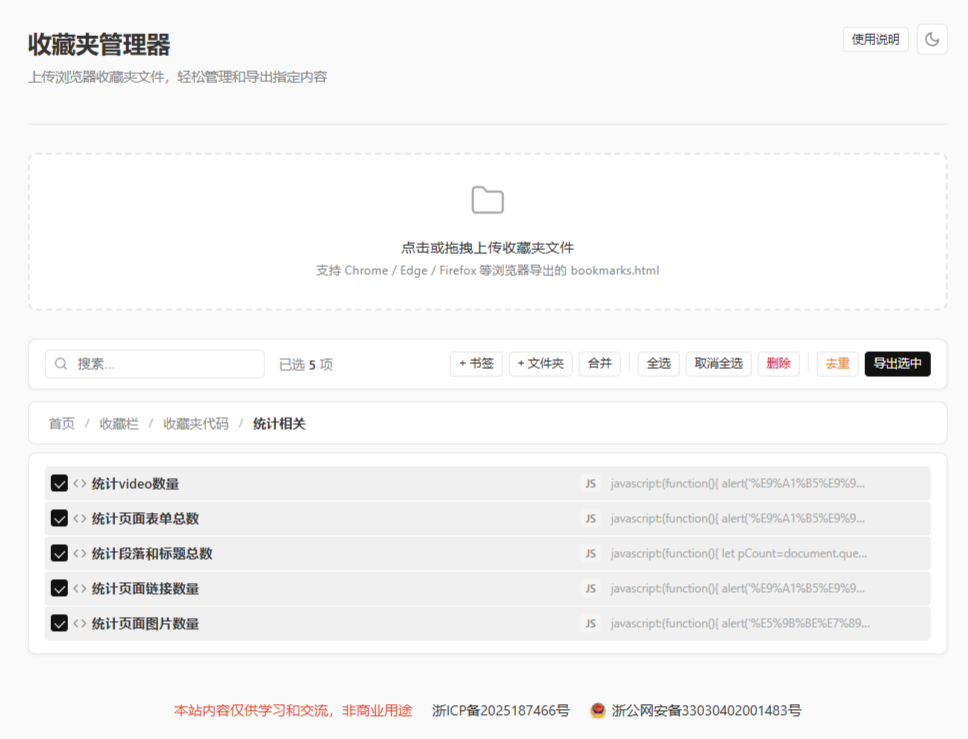

# 收藏夹管理器

纯前端浏览器收藏夹管理工具。上传收藏夹HTML文件，即可浏览、搜索、编辑、整理、去重，并导出为多种格式。

## 功能

- **导入** - 支持所有主流浏览器导出的收藏夹HTML文件
- **树形视图** - 层级文件夹树，支持面包屑导航深入子文件夹
- **内联编辑** - 点击任意项目旁的编辑图标，直接在原位修改标题或链接
- **拖拽排序** - 在树中拖拽移动书签和文件夹，自由调整层级和顺序
- **搜索** - 按标题或 URL 实时过滤
- **批量操作** - 全选、取消全选、批量删除
- **合并** - 将多个收藏夹文件合并为一棵树
- **去重** - 自动检测并清理重复链接，保留第一条
- **导出** - 支持四种格式导出选中或未选中项目：
  - **HTML** - 标准浏览器收藏夹格式，可直接重新导入
  - **JSON** - 结构化数据，方便程序处理或备份
  - **Markdown** - 层级链接列表，适合文档记录
  - **纯文本** - 简单的标题加链接列表
- **暗色模式** - 一键切换亮色/暗色主题，默认跟随系统偏好
- **零依赖** - 纯 HTML、CSS、原生 JavaScript 实现

## 技术说明

- 原生 JavaScript 编写，无框架、无构建步骤
- 使用 CSS 自定义属性实现主题切换（亮色/暗色）
- 主题偏好保存在 `localStorage` 中
- 拖拽基于 HTML5 Drag and Drop API
- 收藏夹 HTML 解析使用浏览器内置的 `DOMParser`

## 截图

